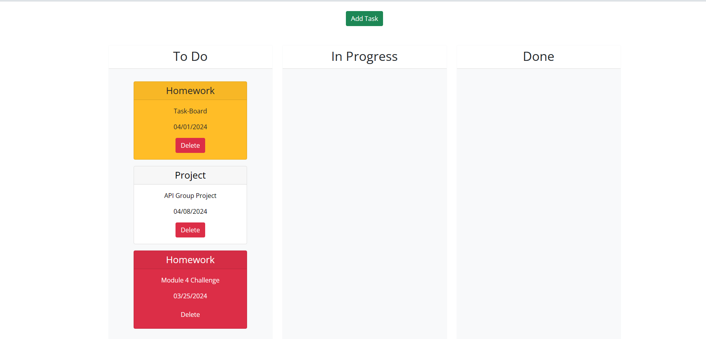
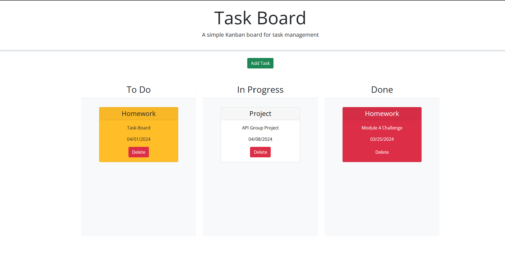

# TaskBoard-Challenge5

## User Story

```
AS A traveler
I WANT to see the weather outlook for multiple cities
SO THAT I can plan a trip accordingly
```

## Acceptance Criteria

```
GIVEN a weather dashboard with form inputs
WHEN I search for a city
THEN I am presented with current and future conditions for that city and that city is added to the search history
WHEN I view current weather conditions for that city
THEN I am presented with the city name, the date, an icon representation of weather conditions, the temperature, the humidity, and the wind speed
WHEN I view future weather conditions for that city
THEN I am presented with a 5-day forecast that displays the date, an icon representation of weather conditions, the temperature, the wind speed, and the humidity
WHEN I click on a city in the search history
THEN I am again presented with current and future conditions for that city
```
## Usage

Link for Repo: https://github.com/thernand09/TaskBoard-Challenge5
Link for Task-Board:


## TryOuts
```
Added modal to inde.html to be ablet to be able to create function in javascript to create cards on task-board.

Added JavaScript function to be able to add task to the task board, to display cards created 

By adding task using Day.js added function to display a calendar for dueDate.

Then added background color on cards based on dueDate being entered.

By clicking delete it will delete the added task 
```

## Screenshots

Add Task function displaying calendar for DueDate

Displaying added task and background color based on Due Date

Showing draggable feature

